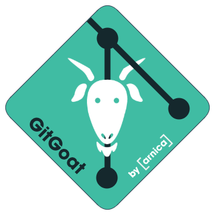

# About GitGoat for GitHub
GitGoat enables DevOps and Engineering teams to test security products intending to integrate with GitHub.
GitGoat is a learning and training project that demonstrates common configuration errors that can potentially allow adversaries to introduce code to production. 



# Introduction
GitGoat was built to enable DevOps and Engineering teams to design and implement a sustainable misconfiguration prevention strategy. It can be used for proof-of-concept projects, such as [OpenSSF](https://openssf.org "Open Source Security Foundation"), [Arnica](https://arnica.io) (coming soon), and others. 

## Important note
> Since GitGoat creates misconfigured assets on GitHub, it is warmly recommended to avoid using it in a production organization. 

## Prerequisites
Here is what you need before kicking off the process:
* Python3 
* Account on GitHub

# Getting started

## Create organization
At this point, GitHub does not support the creation of an organization via APIs. Thus, the organization needs to be created via the user interface. Below are the steps to create an organization:
1. Login to GitHub and navigate to the [organization creation page](https://github.com/account/organizations/new?plan=team_free). 
2. Fill the `Organization account name` (e.g. GitGoat-Demo), "Contact email", and select `My personal account` under  the "This organzation belongs to" section. Click on next and skip the next screen of adding organization members.

## Create a Personal Access Token (PAT) to GitHub
A PAT is required to run GitGoat in order to create repositories and teams, and invite members to the organization created in the previous step. 
To create a PAT, follow these steps:
1. Go to the [new tokens page](https://github.com/settings/tokens/new "GitHub New Tokens Page"). If you are redirected to the login page, authenticate yourself.
2. Fill the fields in the "New personal access token page" and then click on `Generate token`:
   * Set the `expiration` time as needed. Since it will be used only to execute GitGoat, a short expiration time is preferred.
   * Select the following scopes: `repo`, `admin:org`, and `delete_repo`. 
3. Make sure to copy your personal access token now. It will be required for the next step.

## Run a Docker Container
Clone the docker image:
```bash
docker pull ghcr.io/arnica-ext/gitgoat:main
```
Run the container by injecting the PAT as an environment variable:
```bash
docker run -ti --env github_token=[YOUR_PAT] --rm ghcr.io/arnica-ext/gitgoat:main python3 run.py --org [YOUR_ORGANIZATION_NAME]
```
### Additional configurations
> GitGoat can be customzed in the `config.yaml` file. To modify this file or run GitGoat with multiple variations of the config file, please follow the instructions below. 

## Run Locally 
### Set the environment variable
Open your preferred terminal, clone this repo and change the directory to the GitGoat folder.
```bash
git clone https://github.com/arnica-ext/GitGoat.git GitGoat
cd GitGoat
```
On Mac/Linux, set the environment variable `github_pat` using the following command:
```bash
export github_pat=[YOUR_PAT]
```
On Windows, use the following command:
```bash
set github_pat=[YOUR_PAT]
```

### Install the requirements 
Install the required libraries to run GitGoat with the following command:
```bash
python3 -m pip install -r requirements.txt
```

### Run GitGoat
This is the moment of truth, go for it!
```bash
python3 run.py --org [YOUR_ORGANIZATION_NAME]
```
The configuration file `config.yaml` can be adjusted as needed, or if multiple files are used, add `--config [YOUR_CONFIG_FILE.yaml]` to the execution path above. 
In case you'd like to rant and rave about the tokens in this file, these accounts are dummy just to create commits in your organization. Feel free to spend the time to create your accounts, if needed.


## Validate the results
If everything went well, you should see the following in your newly created organization:
* 5 new repositories named Echinacea, Lavender, Chamomile, Calendula, Tarragon (we like the herbs theme).
* Many teams with the naming convention [repository_name]-[admin | maintain | triage | push | pull]. Each team has a specific permission to the associated repository.
* 4 users named archie-gg (a.k.a. Archie Tekkt), billdp-gg (a.k.a. Bill De Pipeline), codeyf-gg (a.k.a. Codey Fie) and debu-gg (a.k.a. Deb Ugeen) as members in the organization and the teams. 
* Many commits by the users in the last 12 months. Keep in mind that the commit dates are vary, but there is only a single push by every user to the relevant repository.

# Contribute to GitGoat
GitGoat is open sourced to the community in order to encourage everyone to test security products in a rapid fashion without impacting the production operations. 
In return, please open issues, create pull requests, or simply add us to the watch list to follow our enhancements in this project. 
